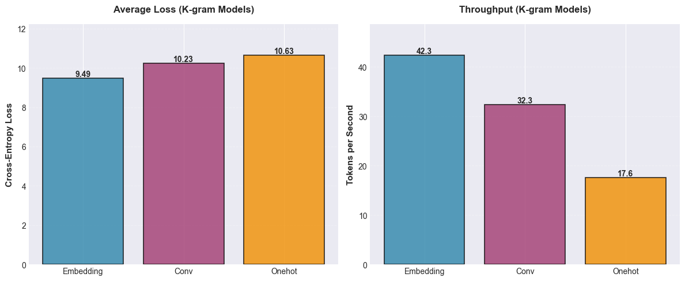
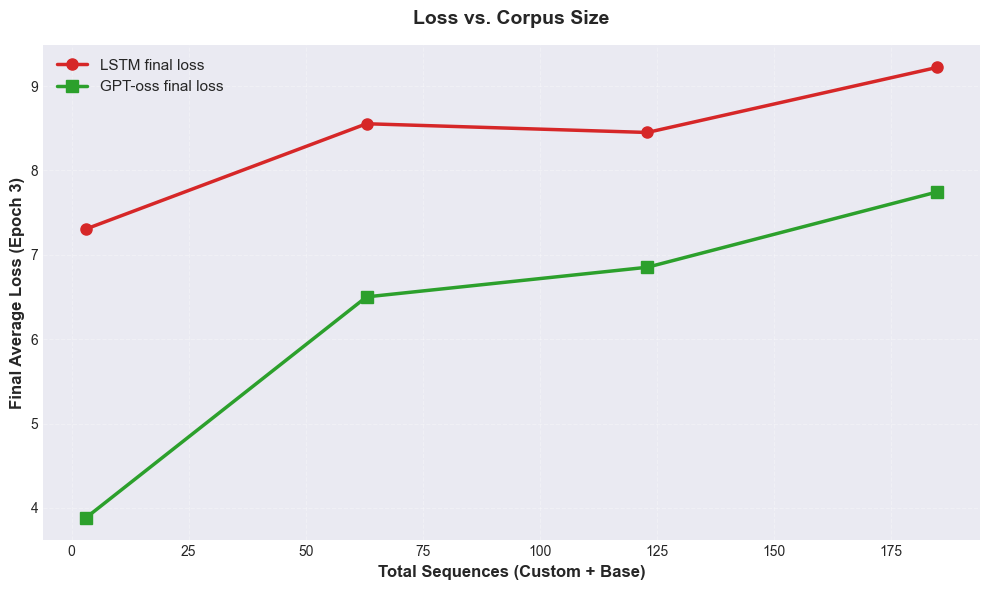
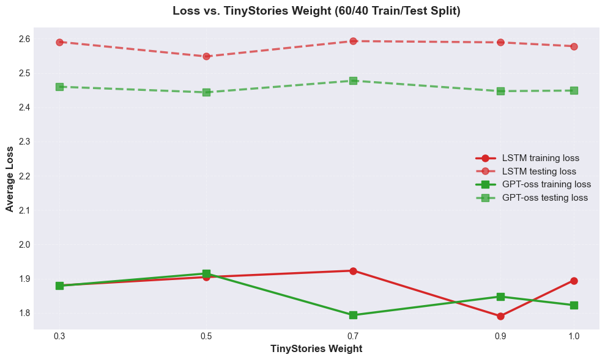
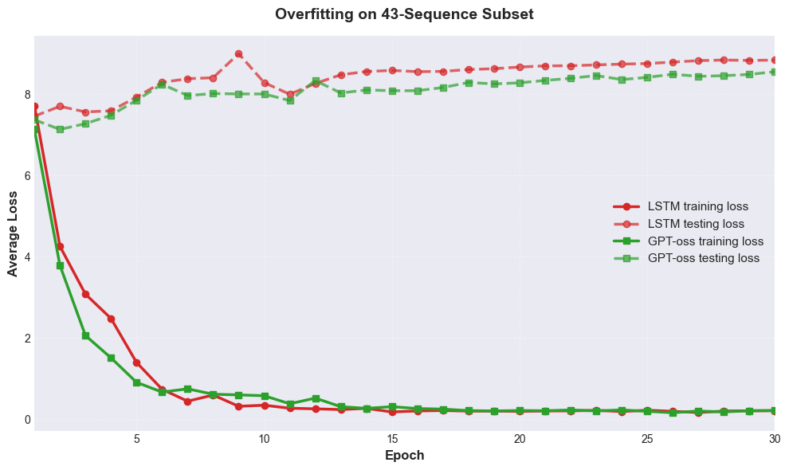
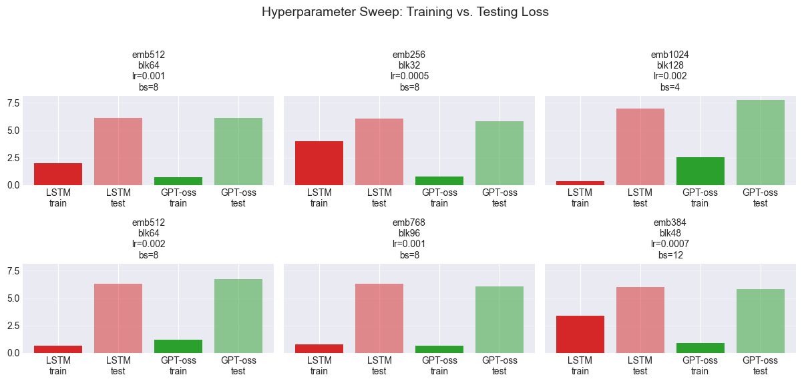

# picoLLM

This project is about building and studying a **very small language model** (a “pico” LLM).  
The main goal is to understand how language models work by training them on simple, small datasets instead of huge internet text.

---

## What this project does

- Trains a tiny language model on short text sequences.
- Lets you change settings (like model size or training steps) and see what happens.
- Saves results so you can compare different runs.
- Includes write-ups that explain the experiments and what we learned.

This is a learning project for class and for building my skills in machine learning.

---

## Main files and folders

- `pico-llm.py` – main Python script for training and testing the model.  
- `pico-llm.ipynb` – Jupyter notebook version to run and see results step by step.  
- `data/` – training data (small text or token sequences).  
- `artifacts/` – saved models, logs, and plots from training runs.  
- `monitor_and_plot.py` and other `collect_*.py` / `.sh` – helper scripts for running many experiments and plotting results.  
- `pico_llm_action_plan.*` and `tasks.*` – project reports and homework write-ups (LaTeX and PDF).

---

## How to run the code

1. **(Optional) Create a virtual environment**

```bash
python -m venv .venv
source .venv/bin/activate   # macOS / Linux
# or
.\.venv\Scripts\activate    # Windows
```

2. **Install Python packages**

If you have a `requirements.txt` file:

```bash
pip install -r requirements.txt
```

If not, install some basic packages:

```bash
pip install torch numpy matplotlib
```

3. **Run a basic training run**

```bash
python pico-llm.py
```

4. **See all command-line options**

```bash
python pico-llm.py --help
```

---
## K-gram model comparison

We tested three K-gram models in this project:

- **Embedding**
- **Conv**
- **Onehot**

The chart below shows two things:

- **Average loss** (left) – lower is better. It means the model makes fewer mistakes.
- **Throughput (tokens per second)** (right) – higher is better. It means the model runs faster.



### K-gram metrics (from `pico-llm.py`)

| Variant   | Average Loss | Tokens per Second | Time (seconds) | Batches | Batch Size |
|----------|--------------|-------------------|----------------|---------|-----------|
| Embedding | 9.49         | 42.3              | 484.52         | 20      | 32        |
| Conv      | 10.23        | 32.3              | 634.04         | 20      | 32        |
| Onehot    | 10.63        | 17.6              | 1160.74        | 20      | 32        |

### What this means

- **Embedding** is the best overall:  
  - lowest loss (most accurate)  
  - fastest tokens per second (most efficient)

- **Conv** is in the middle:  
  - a bit worse loss than Embedding  
  - slower than Embedding but still okay

- **Onehot** is the worst of the three:  
  - highest loss (least accurate)  
  - slowest tokens per second (least efficient)

This experiment shows that using **embeddings** for the K-gram model gives both **better quality** and **better speed** than the simple one-hot version.

## Nucleus Sampling Metrics

To study different decoding methods, we compared **greedy decoding** with several **top-p (nucleus) sampling** settings.  
The table below shows the length of the generated text for each method.

| Label          | top_p | Char Length | Word Count |
|----------------|:-----:|:-----------:|:----------:|
| Greedy         | None  | 149         | 20         |
| Top-p = 0.8    | 0.8   | 120         | 19         |
| Top-p = 0.95   | 0.95  | 148         | 16         |
| Top-p = 1.0    | 1.0   | 126         | 17         |

### What this shows

- **Greedy (no sampling)** produces fairly long but very predictable text.  
- **Top-p = 0.8** gives slightly shorter outputs that are still controlled but a bit more varied.  
- **Top-p = 0.95** can reach similar character length to greedy, but with fewer words (tends to use longer or more complex words).  
- **Top-p = 1.0** is the most random: length is moderate, but the content is more chaotic.

Overall, these results show how changing `top_p` lets us trade off **predictability** vs. **diversity** in the tiny language model’s generations.

## Loss vs. Corpus Size (LSTM vs. GPT-oss)

We compared an LSTM model and a small GPT-style model (“GPT-oss”) on different
corpus sizes. The x-axis shows the **total number of sequences**
(base + custom), and the y-axis shows the **final average loss after 3 epochs**.



### Metrics

| Total Sequences | Custom Sequences | LSTM Final Loss | GPT-oss Final Loss |
|----------------:|-----------------:|----------------:|-------------------:|
| 3               | 0                | 7.31            | 3.88               |
| 63              | 60               | 8.55            | 6.50               |
| 123             | 120              | 8.45            | 6.85               |
| 185             | 182              | 9.22            | 7.75               |

### What we see

- **GPT-oss always has lower loss than the LSTM**, so it fits the data better at every corpus size.  
- As we add more custom data, the loss for **both** models goes up, which suggests the custom corpus is harder to model than the tiny base set.  
- Even when the task gets harder, the GPT-style model stays ahead, showing that the transformer-style architecture works better than the simple LSTM in this setup.

## Loss vs. TinyStories Weight (60/40 Train/Test Split)

Here we change how much TinyStories data we mix into the training set.
The x-axis is the **TinyStories weight**, and the y-axis is the **average loss**
for both training and testing.



### Metrics

| TinyStories Weight | LSTM Train Loss | LSTM Test Loss | GPT-oss Train Loss | GPT-oss Test Loss |
|-------------------:|----------------:|----------------:|--------------------:|-------------------:|
| 0.30               | 1.8803          | 2.5906          | 1.8790              | 2.4597             |
| 0.50               | 1.9046          | 2.5481          | 1.9152              | 2.4434             |
| 0.70               | 1.9234          | 2.5928          | 1.7938              | 2.4773             |
| 0.90               | 1.7910          | 2.5891          | 1.8478              | 2.4469             |
| 1.00               | 1.8949          | 2.5781          | 1.8229              | 2.4486             |

### What we see

- **Testing loss is always higher than training loss** for both models, which is normal.
- The **GPT-oss model has slightly lower test loss** than the LSTM at every weight,
  so it generalizes a bit better on this task.
- Changing the TinyStories weight does **not** drastically change test loss, but it
  slightly shifts how well each model fits the mix of custom data vs. TinyStories.
- Overall, the GPT-style model again stays ahead of the LSTM, even when we change
  how much TinyStories data we use.


## Overfitting on a Tiny Dataset

We ran an overfitting experiment on a **very small custom subset**:

- 43 total sequences  
- 60% training / 40% testing  
- 30 epochs, batch size 4  

The figure below shows how the models behave over time.



- **Training loss** (solid lines) keeps going down close to zero.  
- **Testing loss** (dashed lines) first goes down, then flattens, and then goes back up.  

This is a classic sign of **overfitting**: the models start to **memorize** the tiny training set instead of learning patterns that generalize.

### Final losses

| Model   | Final Training Loss | Final Testing Loss |
|--------|---------------------:|-------------------:|
| LSTM   | 0.2130               | 8.8402             |
| GPT-oss| 0.2157               | 8.5551             |

Both models fit the training data extremely well (very low training loss) but do poorly on the test split (high testing loss).  
GPT-oss memorizes a bit faster than the LSTM, but **both eventually saturate** on this tiny dataset.

## Hyperparameter Sweep: Training vs. Testing Loss

We ran a small **hyperparameter sweep** and trained several model settings for  
8 epochs with **20% of the data held out for testing**.

We changed:

- **Embedding size** (emb)
- **Block size** (blk)
- **Learning rate** (lr)
- **Batch size** (bs)

and then recorded the final **training** and **testing** loss for both the LSTM and GPT-oss models.



### Results

| Config (emb / blk / lr / bs) | LSTM Train | LSTM Test | GPT-oss Train | GPT-oss Test |
|------------------------------|-----------:|----------:|--------------:|-------------:|
| emb512 blk64 lr=0.001 bs=8  | 2.005      | 6.106     | 0.717         | 6.140        |
| emb256 blk32 lr=0.0005 bs=8 | 4.021      | 6.076     | 0.793         | 5.853        |
| emb1024 blk128 lr=0.002 bs=4| 0.338      | 6.954     | 2.553         | 7.746        |
| emb512 blk64 lr=0.002 bs=8  | 0.677      | 6.330     | 1.232         | 6.732        |
| emb768 blk96 lr=0.001 bs=8  | 0.775      | 6.306     | 0.691         | 6.063        |
| emb384 blk48 lr=0.0007 bs=12| 3.378      | 5.985     | 0.896         | 5.826        |

### What we see

- Training loss changes a lot between settings, but **testing loss stays in a similar range**  
  → no single hyperparameter combo is a huge winner here.
- GPT-oss often gets **lower training loss** than the LSTM, but both models have  
  **similar test loss**, which suggests the tiny dataset is the main limit.
- Overall, these sweeps show that **reasonable hyperparameters matter**, but they do not fully fix
  the generalization problems on such small data.

